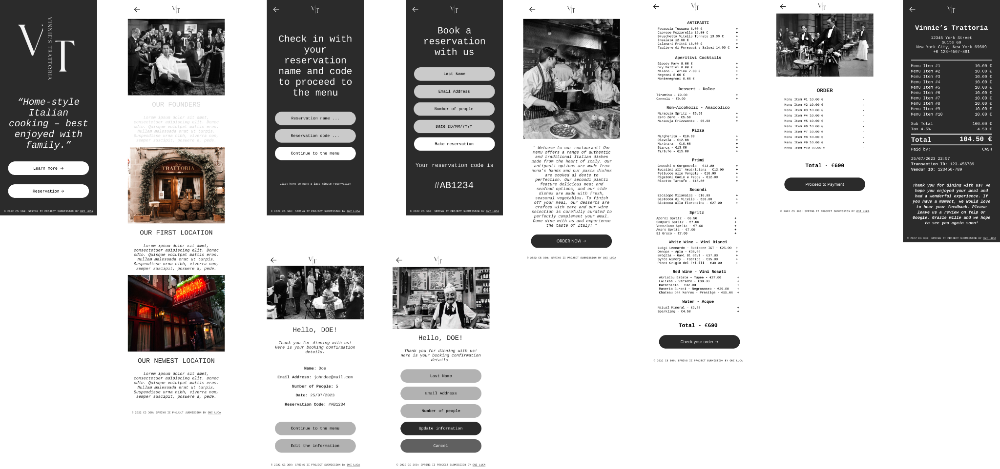

# Vinnie's Trattoria Mobile App

## Overview
The Vinnie's Trattoria Mobile App is a cross-platform application designed to enhance customer interaction with Vinnie's Trattoria. The app provides features such as browsing the menu, making reservations, viewing blog posts, and staying updated with the latest news and offers from the restaurant.

## Design



## Features
- **Booking System:**
  - Users can book a reservation at the restaurant and change their details at any time.
- **Menu Browsing:**
  - Users can view the list of available items on the menu.
- **Item Selection:**
  - Users can select items from the menu to add them to their order.
- **Order Management:**
  - Users can view their selected items, remove items from the order, and calculate the total price.
- **Order Placement:**
  - Users can proceed to the payment process and complete their order.
- **Orientation Handling:**
  - The app supports changes in screen orientation, providing a seamless experience for users.
- **Sensor Handling:**
  - Drop the order with a shake of the phone.
- **Notifications:**
  - Stay informed about special offers, events, and seasonal menus.
- **User-Friendly Interface:**
  - Clean, intuitive design for easy navigation.

## Technologies Used
- **Frontend:**
  - Java (for core logic and app functionality)
  - XML (for UI design)
- **Backend:**
  - SQLite (for storing menu items, reservations, and orders)
- **Design:**
  - Designed in Figma
- **Development Environment:**
  - Android Studio

## Installation

1. Clone the repository:
   ```bash
   git clone https://github.com/OJOCoding/VinniesTrattoriaAPP.git
   cd VinniesTrattoriaAPP
   ```

2. Open the project in Android Studio:
   - Launch Android Studio and select "Open an Existing Project."
   - Navigate to the `VinniesTrattoriaAPP` folder and open it.

3. Build the project:
   - Sync the Gradle files and resolve dependencies.

4. Run the app:
   - Connect an Android device or start an emulator.
   - Click the "Run" button in Android Studio.

## Project Structure
```plaintext
VinniesTrattoriaAPP/
├── app/                # Core application files
│   ├── src/            # Source code (Java and XML)
│   ├── res/            # Resources (layouts, drawables, etc.)
├── database/           # SQLite database files
├── assets/             # Static assets (images, fonts, etc.)
├── README.md           # Project documentation
└── LICENSE             # License file
```

## Usage
- **Local Development:**
  - Use Android Studio to run the app on a physical device or emulator.
- **Customization:**
  - Update Java files in the `src/` directory to modify functionality.
  - Edit XML files in the `res/` directory for design changes.

## Contributing
Contributions are welcome! To contribute:
1. Fork the repository.
2. Create a new branch for your changes:
   ```bash
   git checkout -b feature-name
   ```
3. Commit your changes and push to your fork.
4. Open a pull request detailing your updates.

## License
This project is licensed under the [MIT License](LICENSE).

## Contact
For any questions or support, please reach out:
- GitHub: [OJOCODING](https://github.com/OJOCODING)
- Email: [oniluca@ymail.com](mailto:oniluca@ymail.com)

---

Thank you for checking out the Vinnie's Trattoria Mobile App! We hope it provides a seamless experience for customers to connect with the restaurant.
